# AWS EKS GitOps Observability Project

Production-style Kubernetes platform on AWS built with **Terraform**, **EKS**, **Helm**, **ArgoCD**, **Prometheus/Grafana**, and **GitHub Actions**.

This project started as a learning build to understand each layer of a modern DevOps stack end to end: infrastructure provisioning, Kubernetes packaging, GitOps deployments, observability, CI/CD automation, and cost-aware cleanup.

---

## Project Summary

This project provisions an Amazon EKS cluster with Terraform, deploys a Node.js demo app with Helm, shifts application delivery to GitOps using ArgoCD, adds observability with Prometheus and Grafana, and automates image build/push plus GitOps updates through GitHub Actions.

The demo application exposes:

- `/` for app response and version
- `/health` for readiness/liveness validation
- `/metrics` for Prometheus scraping

The deployment was validated through:

- running EKS worker nodes
- successful Helm deployment
- ArgoCD sync and rollout after Git commits
- Prometheus scrape integration
- Grafana dashboard snapshots
- GitHub Actions pipeline success

---

## What I Built

### Infrastructure

- Provisioned a custom **VPC**, public/private subnets, Internet Gateway, NAT Gateway, route tables, IAM roles, EKS cluster, and managed node group using **Terraform**.
- Configured Kubernetes access with `aws eks update-kubeconfig`.

### Kubernetes Packaging and Deployment

- Built a small **Node.js + Express** application with Prometheus metrics using `prom-client`.
- Containerized the app using a **multi-stage Dockerfile**.
- Pushed images to **Amazon ECR**.
- Packaged the Kubernetes deployment as a **Helm chart** with:
  - Deployment
  - Service
  - HPA
  - health probes
  - resource requests/limits

### GitOps

- Installed **ArgoCD** in-cluster.
- Created an ArgoCD application that tracks the repo and syncs the Helm chart.
- Verified GitOps behavior by changing values in Git and watching pods roll in the cluster.

### Observability

- Installed **kube-prometheus-stack**.
- Verified **Prometheus** and **Grafana**.
- Added a **ServiceMonitor** for app metrics.
- Captured Grafana dashboards for cluster, namespace, and node visibility.

### CI/CD

- Added **GitHub Actions** workflow for:
  - test
  - Docker build
  - ECR push
  - auto-update of Helm image tag
- Verified ArgoCD sync after pipeline-driven changes.

---

## Key Outcomes

- Built a complete **Terraform → EKS → Helm → ArgoCD → Prometheus/Grafana → GitHub Actions** workflow.
- Verified application endpoints and metrics inside the cluster.
- Demonstrated **GitOps-based rollouts** from Git commits.
- Practiced real-world troubleshooting across Helm, ECR, ArgoCD scheduling, dashboard data, GitHub permissions, and AWS cleanup.
- Added strong documentation evidence with screenshots and terminal logs for each milestone.

---

## Architecture

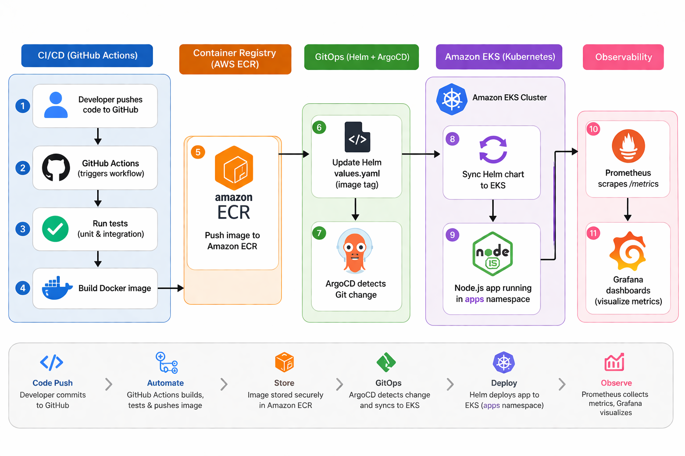

### Resource-Level View in ArgoCD

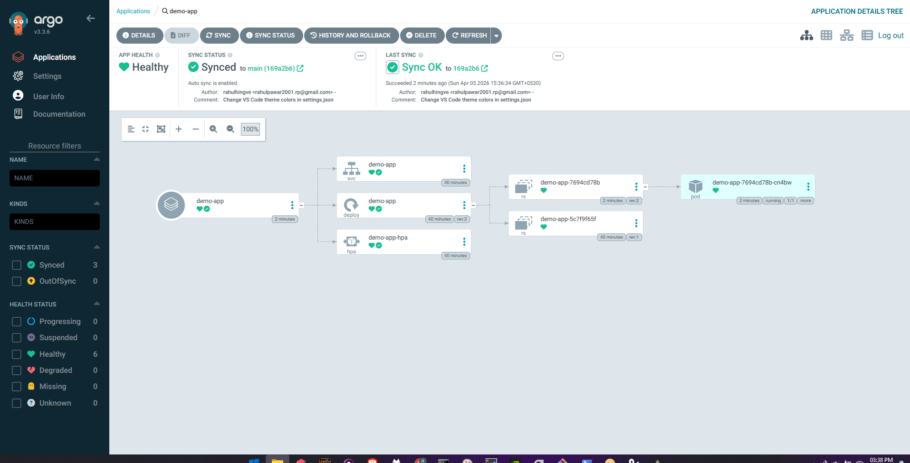

---

## Tech Stack

| Layer                  | Tooling                                |
| ---------------------- | -------------------------------------- |
| Infrastructure as Code | Terraform                              |
| Cloud                  | AWS EKS, ECR, VPC, IAM, EC2 networking |
| Containerization       | Docker                                 |
| Orchestration          | Kubernetes                             |
| Packaging              | Helm                                   |
| GitOps                 | ArgoCD                                 |
| CI/CD                  | GitHub Actions                         |
| Monitoring             | Prometheus                             |
| Visualization          | Grafana                                |
| App                    | Node.js, Express, prom-client          |

---

## Repository Structure

```text
aws-eks-gitops-observability/
├── app/
│   ├── Dockerfile
│   ├── index.js
│   └── package.json
├── terraform/
│   ├── eks.tf
│   ├── main.tf
│   ├── outputs.tf
│   ├── variables.tf
│   ├── versions.tf
│   └── vpc.tf
├── helm-charts/
│   └── app/
│       ├── Chart.yaml
│       ├── values.yaml
│       └── templates/
│           ├── deployment.yaml
│           ├── hpa.yaml
│           └── service.yaml
├── k8s/
│   ├── namespaces.yaml
│   ├── rbac.yaml
│   └── servicemonitor.yaml
├── argocd/
│   └── demo-app.yaml
└── .github/
    └── workflows/
        └── ci-cd.yml
```

---

## Deployment Flow

### 1. Provision Infrastructure

- `terraform init`
- `terraform validate`
- `terraform plan`
- `terraform apply`

### 2. Connect to EKS

- `aws eks update-kubeconfig`
- verify with `kubectl get nodes`

### 3. Prepare Cluster

- apply namespaces
- apply RBAC
- verify roles, rolebindings, and service account

### 4. Build and Push Application Image

- local Docker build
- push image to ECR

### 5. Deploy with Helm

- `helm lint`
- `helm install` / `helm upgrade --install`
- verify pods, service, HPA

### 6. Shift to GitOps

- install ArgoCD
- create ArgoCD Application
- sync Helm chart from GitHub

### 7. Add Observability

- install kube-prometheus-stack
- apply ServiceMonitor
- validate dashboards and metrics

### 8. Automate with CI/CD

- GitHub Actions builds and pushes image
- workflow updates Helm values
- ArgoCD syncs the change to the cluster

---

## Application Verification

The application was verified after Helm deployment using port-forward and curl.

| Pod Running                                               | App Resources Verification                                                       |
| --------------------------------------------------------- | -------------------------------------------------------------------------------- |
| 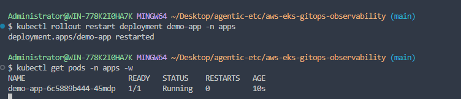 | 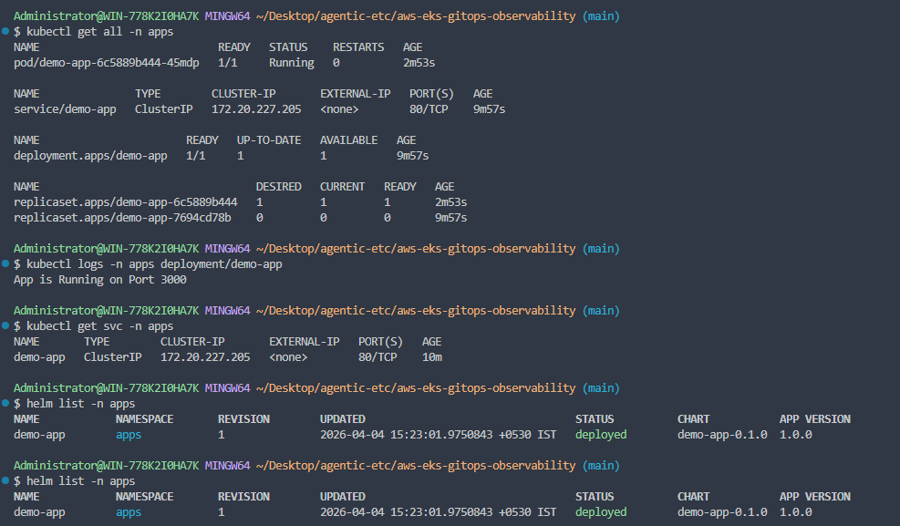 |

### Metrics Validation

The app successfully exposed Prometheus metrics from `/metrics`, including Node.js runtime metrics and custom HTTP metrics such as `http_requests_total` and `http_request_duration_seconds`.

---

## GitOps Validation

ArgoCD successfully synced the app from Git and showed a healthy deployment state.

| ArgoCD Dashboard                                            | Application Synced                                                            |
| ----------------------------------------------------------- | ----------------------------------------------------------------------------- |
| 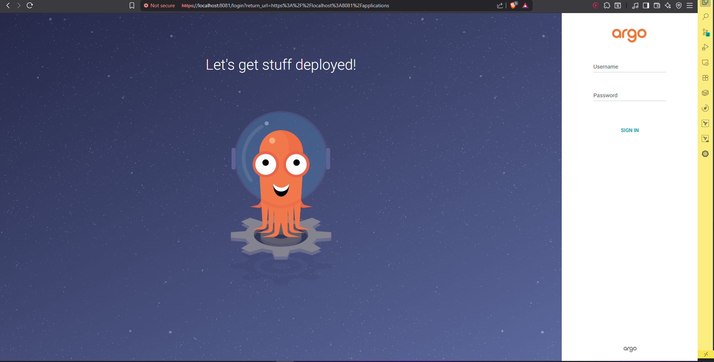 | 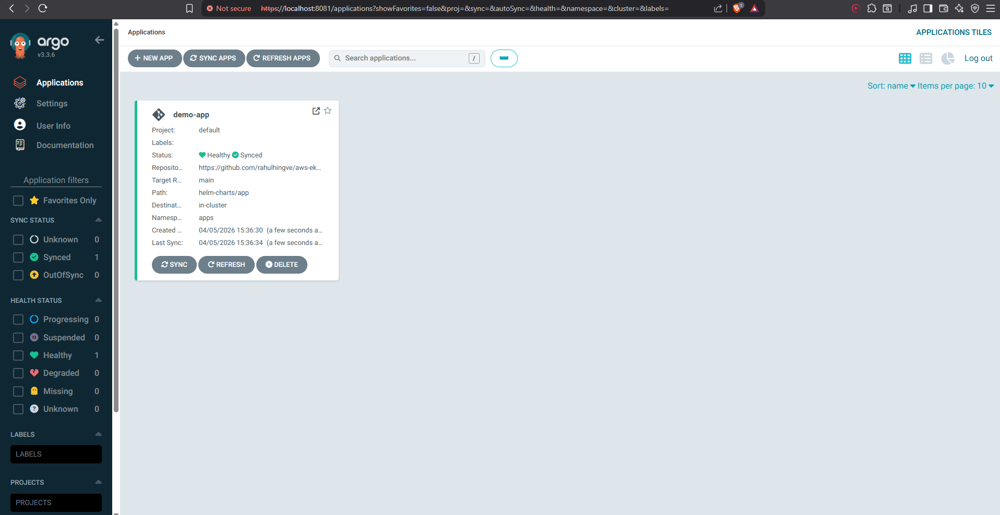 |

### Pod Rollout During Git Change

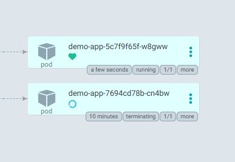

This validated the GitOps loop:

1. update Git
2. ArgoCD detects drift
3. cluster reconciles to desired state

---

## Observability Validation

Prometheus and Grafana were installed successfully, and cluster-level plus application-level views were captured.

| Monitoring Stack Installed                                              | Monitoring Namespace Resources                                                |
| ----------------------------------------------------------------------- | ----------------------------------------------------------------------------- |
| 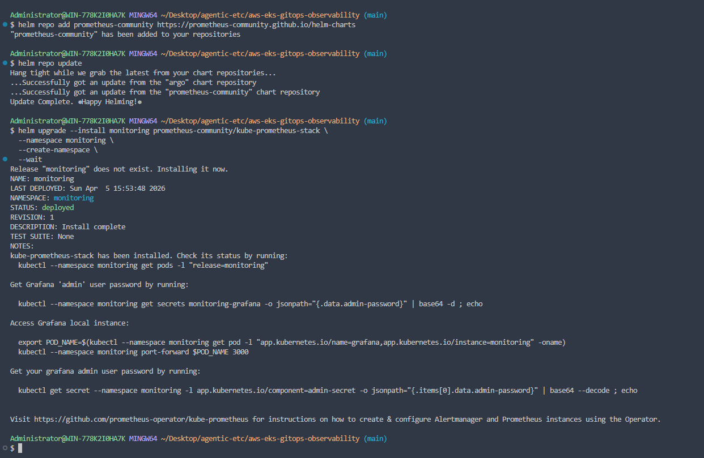 | 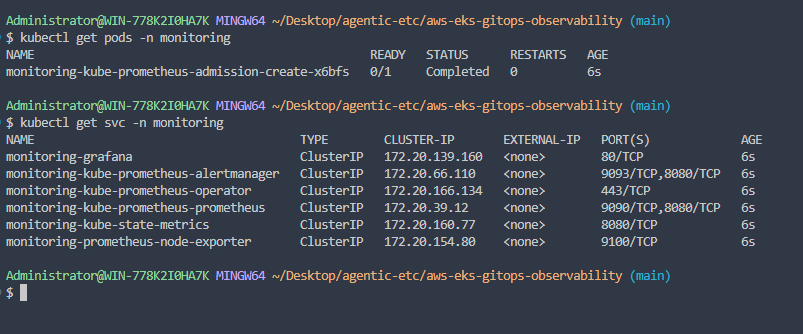 |

| Grafana Dashboard                                             | Cluster Resource Dashboard                                                      |
| ------------------------------------------------------------- | ------------------------------------------------------------------------------- |
| 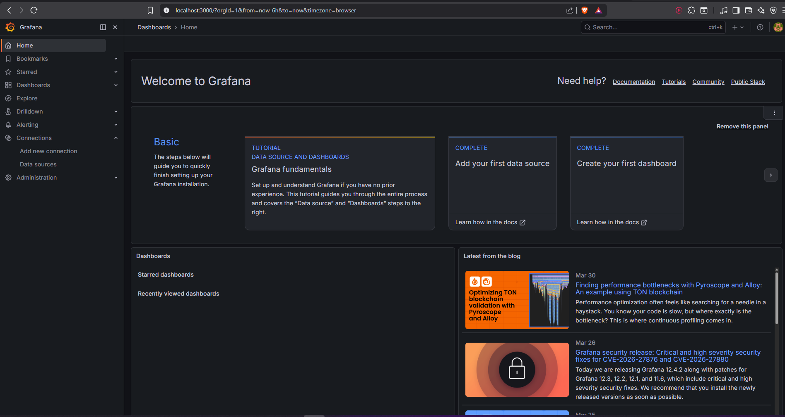 | 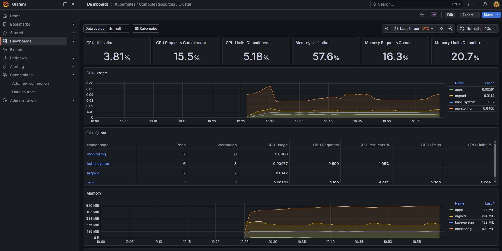 |

| Namespace Dashboard                                                            | Node Exporter Dashboard                                                           |
| ------------------------------------------------------------------------------ | --------------------------------------------------------------------------------- |
| 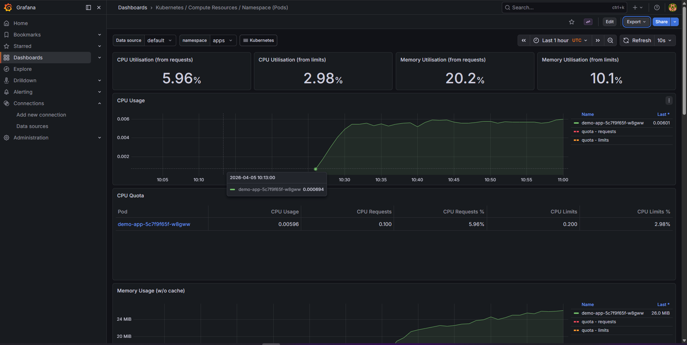 | 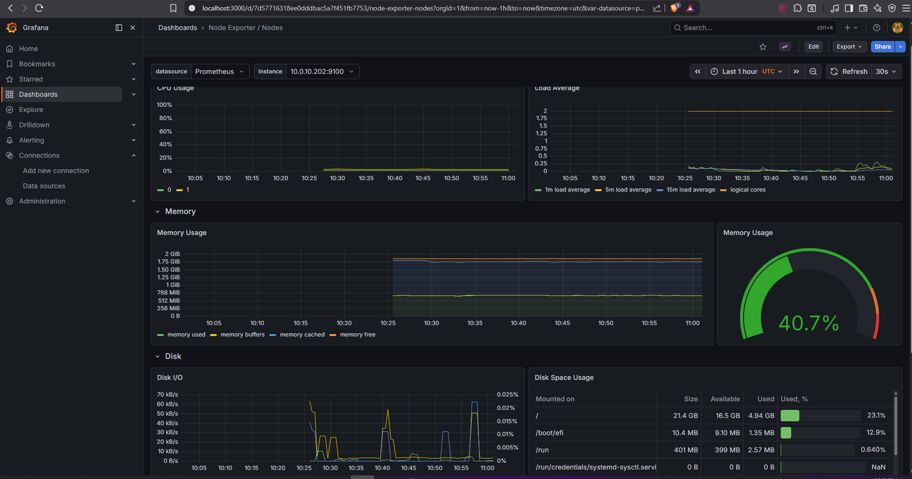 |

### ServiceMonitor Applied

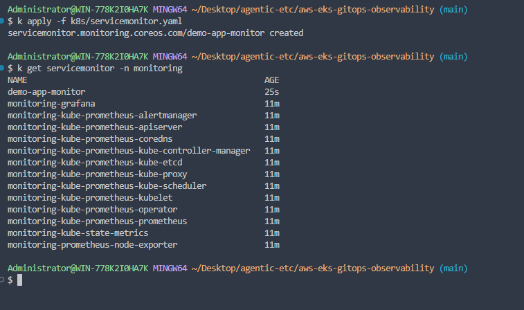

---

## CI/CD Validation

GitHub Actions eventually completed successfully after fixing token permissions for pushing Helm value updates back to the repository.

| Workflow Started                                                           | Workflow Succeeded                                                  |
| -------------------------------------------------------------------------- | ------------------------------------------------------------------- |
| 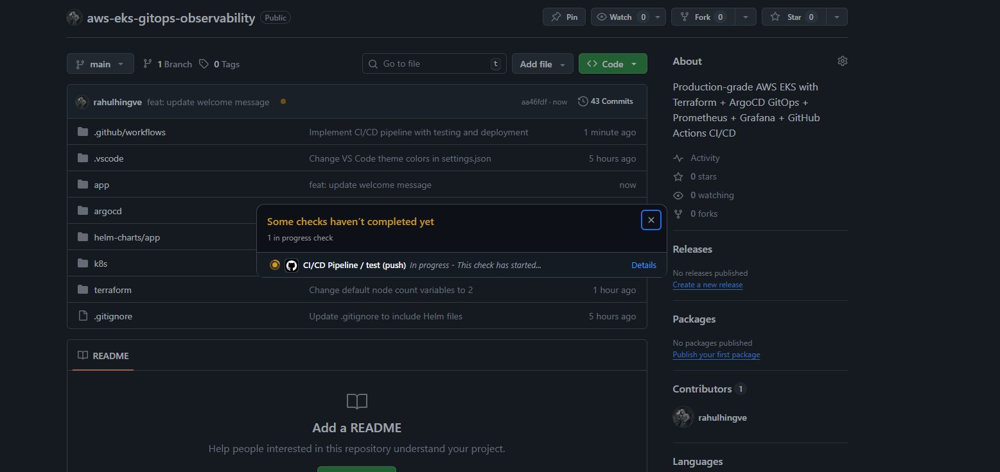 | 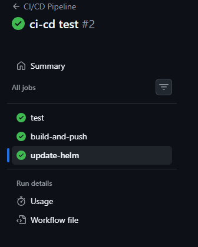 |

### Initial `update-helm` Failure

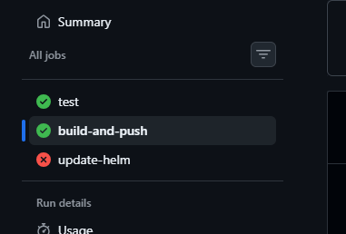

The final working flow became:

- push code
- GitHub Actions builds and pushes image to ECR
- workflow updates Helm image tag in Git
- ArgoCD syncs latest desired state

---

## Troubleshooting and Lessons Learned

This project was not only about a successful deploy. It also included multiple real debugging cycles.

### 1. Helm HPA rendering issue

**Problem:** HPA was not being created correctly.
**Cause:** typo in values key: `autoscalling` instead of `autoscaling`.
**Fix:** corrected the values key and reran `helm upgrade --install`.

### 2. Service template schema error

**Problem:** Helm install failed with a Service schema error.
**Cause:** `selector` placement in `service.yaml` was incorrect.
**Fix:** corrected the Service manifest structure so `selector` stayed under `spec` and not under `ports`.

### 3. `ErrImagePull` / `ImagePullBackOff`

**Problem:** pod could not pull image from ECR.
**Cause:** image tag/repository mismatch during initial deploy.
**Fix:** verified deployed image path, repushed the exact `1.0.0` image to ECR, and restarted the Deployment.

### 4. ArgoCD install blocked on a single node

**Problem:** ArgoCD application controller stayed pending.
**Cause:** scheduler reported `Too many pods` on a single-node cluster.
**Fix:** increased the EKS managed node group from 1 node to 2 nodes.

### 5. Grafana dashboards showing `N/A`

**Problem:** imported dashboards initially showed missing metrics.
**Cause:** dashboard/data-source/target mismatch rather than app failure.
**Fix:** validated Prometheus targets, ServiceMonitor, and switched to compatible dashboards for the installed stack.

### 6. GitHub Actions `update-helm` failed with 403

**Problem:** workflow could build and push image but could not push the updated `values.yaml`.
**Cause:** insufficient `GITHUB_TOKEN` permissions.
**Fix:** enabled repo workflow write permissions and added `contents: write` in workflow permissions.

### 7. Terraform destroy blocked by hidden AWS dependency

**Problem:** destroy failed when detaching the Internet Gateway / deleting the VPC.
**Cause:** orphaned ELB/network dependency still existed even after cluster-side cleanup.
**Fix:** manually identified the leftover AWS load balancer/network dependency, deleted it, and reran destroy successfully.

This debugging path made the project much stronger because it reflects real operational work rather than only happy-path setup.

---

## Screenshots Included

The bundle includes cleaned screenshot names under:

```text
docs/screenshots/
```

---

## Logs Included

Cleaned log copies are included under:

```text
docs/logs/
```

Important logs include:

- `terraform-apply.txt`
- `helm-install-dryrun.txt`
- `curl.txt`
- `argo-cd-debug-and-success.txt`
- `hpa-debug.txt`

---

## Cost Awareness and Cleanup

This project was built with repeated destroy-and-recreate cycles to keep AWS costs under control.

Typical cleanup approach:

- `terraform destroy`
- verify EKS and VPC resources are gone
- remove orphaned AWS resources if necessary
- optionally remove ECR repository/images when done

One of the practical lessons from this project was that cloud cleanup can require manual validation when managed services leave behind dependencies.

---

## What I Learned ⭐⭐🤩🤩

- How Terraform resources map to actual AWS networking and EKS infrastructure
- How Helm templating separates chart metadata, values, and Kubernetes manifests
- How ArgoCD turns Git into the source of truth for cluster state
- How Prometheus scraping and Grafana dashboards fit into Kubernetes observability
- How CI/CD and GitOps complement each other instead of replacing one another
- How to debug real integration issues across AWS, Kubernetes, Helm, GitHub Actions, and monitoring tools

---

## Possible Next Improvements

- Add NGINX Ingress and TLS with a custom domain
- Add metrics-server for full HPA CPU metric visibility
- Add Trivy or image scanning in CI pipeline
- Replace static AWS keys with GitHub OIDC + IAM role assumption
- Add rollout verification job after GitHub Actions deploys
- Improve Grafana dashboard provisioning through code

---

## Final Note

This project is valuable not only because the stack works, but because it documents the full learning and debugging journey needed to get a real cloud-native delivery workflow running end to end.
